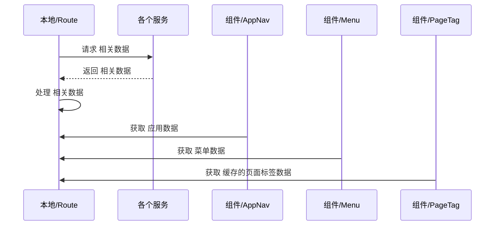
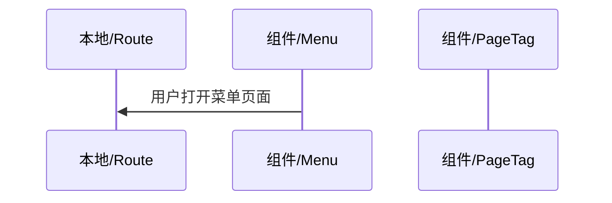

# Route Store

- 路由系统的相关设计

## Service

## Store

### State

- AppTreeRaw
- AppTreeCache
- MenuTreeRaw
- MenuTreeCache
- PageTagTreeRaw
- PageTagTreeCache

### Roles

- Serve/Route 
- Serve/Auth 
- Serve/I18n
- Serve/Tannet
- Serce/Theme
- Store/Route 
- Store/Auth
- Store/User
- Component/Menu
- Component/PageTag

### 数据流动

